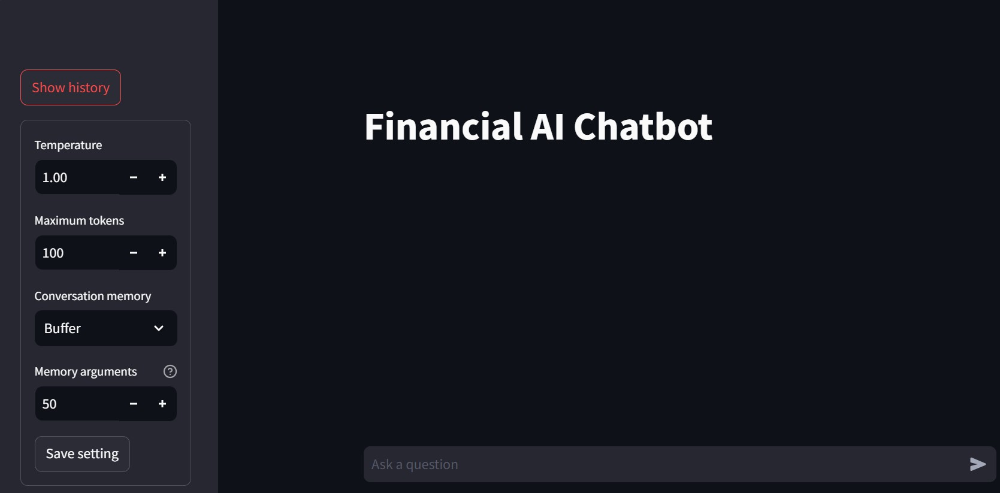
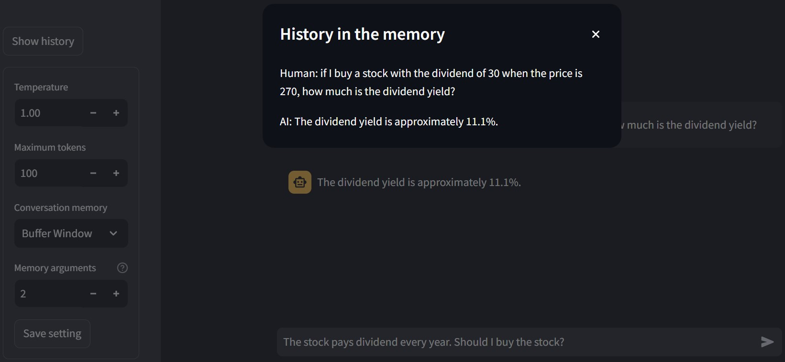
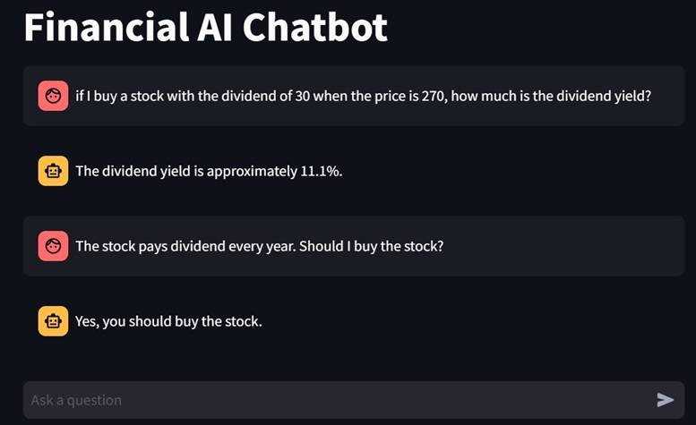
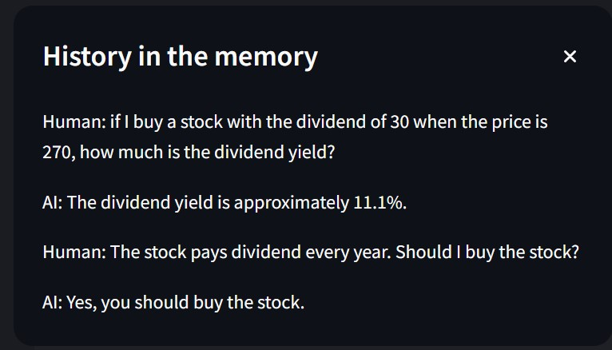
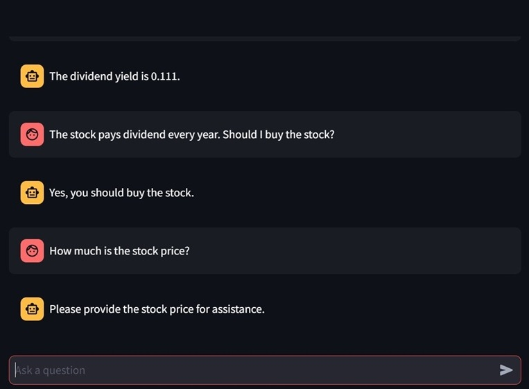
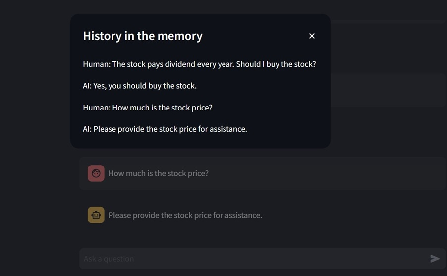
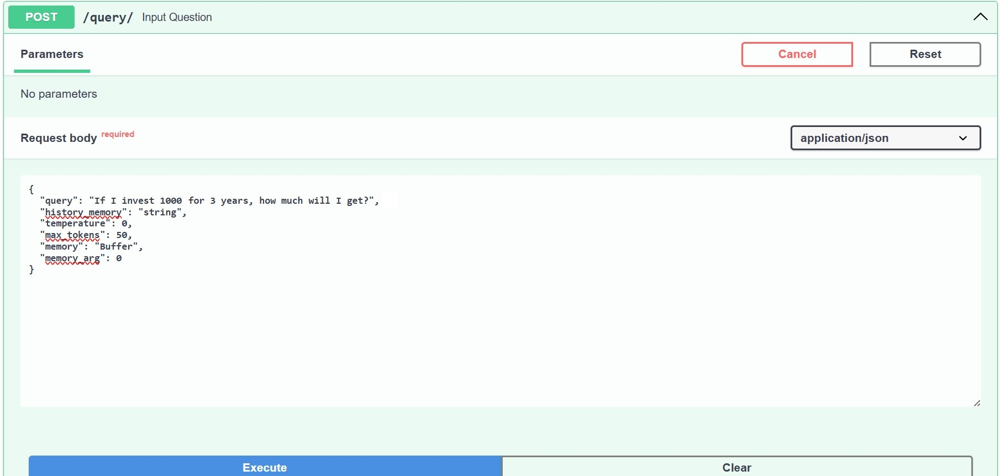
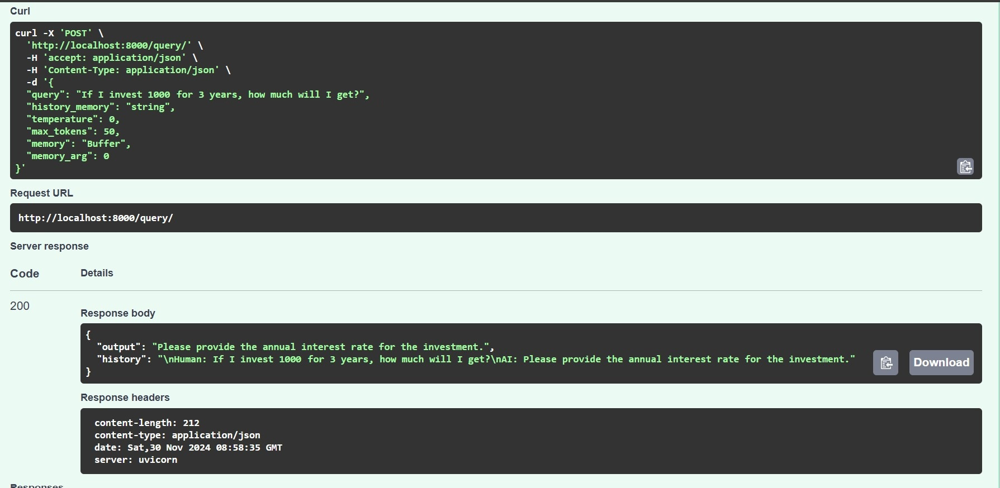

# AI-Agent-Chatbot

This project aims to build an AI Agent which the user can interact with. The user interface is a chatbot built in Streamlit. It also has a conversation memory so that it remembers and relates to the previous chats.

To use this application, run app.py as the user interface and api.py as the backend. The app.py provides the Streamlit interface and users can specify the temperature, maximum tokens, conversation memory, and memory argument.
The title of the chatbot is Financial AI Chatbot. Users can type in financial questions and the chatbot will answer the questions.

There are 5 conversation memories to choose from ConversationBufferMemory, ConversationBufferWindowMemory, ConversationSummaryMemory, ConversationSummaryBufferMemory, and ConversationTokenBufferMemory. Users can learn the difference between each memory. Memory argument is used to specify the argument or parameter from each memory type. It is k (the number of previous chats to remember) for ConversationBufferWindowMemory or Max_token_limit for ConversationSummaryBufferMemory and ConversationTokenBufferMemory. 

This tool utilizes OpenAI API and an AI agent. The AI agent has 3 tools/functions: 
- "investing": Calculate the final value of investment given the capital, interest rate per annum, and tenure;
- "calculate_dy": Calculate the dividend yield based on the dividend and current price;
- "entry_criteria": Decide whether to buy the stock (entry) based on the dividend yield, current price, and yearly payout.

## Demonstration

Here is the result of the first question. The user asks, "If I buy a stock with the dividend of 30 when the price is 270, how much is the dividend yield?"
The AI agent then will call the function "calculate_dy" and return the answer, 11.1%. The LLM will generate a proper sentence to reply to the question. The history of this first conversation is saved. Clicking the button "Show History" will display the saved history.

The user then asks the following question, "The stock pays dividends every year. Should I buy the stock?" The AI Agent will call the tool "entry_criteria" to answer the second question. The tool "entry_criteria" requires dividend yield, current price, and yearly payout. The user has given the yearly payout information by saying that the dividend is paid every year. The dividend yield and current price are provided from the previous conversation (found in the chat history). Thus, the AI agent recommends to buy the stock.

Notice that the memory used in this conversation is: Conversation Buffer Window Memory with k = 2. This memory remembers only the past 2 conversations. This can be seen in the figure below (history in the memory). It only contains 2 recent conversations and the first conversation is not found.

Then, the user tries to ask the third question requiring the information from the first conversation, "How much is the stock price?" The stock price is mentioned by the user in the first conversation, but it is not saved in the memory anymore. Thus, the chatbot cannot answer the question.

## Observe the API

The next demonstration is to observe the API JSON. The user asks, "If I invest 1000 for 3 years, how much will I get?" The below image shows the request body.

Then, the chatbot answers, "Please provide the annual interest rate for the investment." Examine the image below showing that the API returns the answer in the "output" and the "history".

# How to run
Run the streamlit `streamlit run app.py`

Run the FAST API `python api.py`